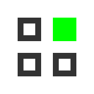

# <p align="center">PIXEL.ART</p>

<p align="center">
  
</p>

<p align="center">
  <strong>A high-performance, dark-themed pixel art editor and animator built for the modern web.</strong>
</p>

<p align="center">
  
  
  
  
</p>

---

PIXEL.ART is a premium creative suite designed for pixel artists and game developers. It combines the power of a desktop application with the accessibility of a web environment, featuring a technical dark theme, real-time rendering, and advanced animation tools.

## ✨ Features

### 🖌️ Professional Drawing Suite
- **Advanced Pixel Engine** — Precise sub-pixel rendering with coordinate snapping.
- **Dynamic Brush Control** — Adjustable brush sizes and eraser modes.
- **Technical Color Picker** — Full HSV/RGB/HEX support with a technical drag-and-drop interface.
- **Smart EyeDropper** — Sample colors from the canvas or use the native browser EyeDropper API.

### 🎬 Animation & Timeline
- **Frame-by-Frame Editing** — Powerful multi-frame timeline with real-time preview.
- **Interactive Reordering** — Drag and drop frames to reorganize your animation sequence.
- **Onion Skinning** — Visual guidance by overlaying adjacent frames.
- **Playback Controls** — Adjustable FPS and instant playback for high-fidelity previews.

### 🌓 Premium Experience
- **Technical Dark Theme** — Optimized for long creative sessions with high-contrast technical details.
- **Interactive Gallery** — A draggable, physics-based showcase of community masterpieces.
- **Session-Aware Workspace** — Personalized dashboard and project management via secure authentication.
- **Responsive Layout** — A stabilized, professional UI that adapts to your workflow.

### 💾 Persistence & Export
- **Cloud & Local Storage** — Secure project persistence with thumbnail previews.
- **High-Fidelity Export** — Export your creations as crisp PNGs or scalable SVGs.

---

## 🛠️ Tech Stack

- **Framework:** Next.js 14 (App Router)
- **Styling:** Tailwind CSS 4.0
- **Animations:** Framer Motion 12
- **Authentication:** NextAuth.js (GitHub & Google)
- **Icons:** Lucide React
- **Database:** Mongoose / MongoDB

---

## 🚀 Getting Started

### Prerequisites
- **Node.js** v20 or higher
- **npm** or **pnpm**

### Installation

1. **Clone the repository:**
   ```bash
   git clone https://github.com/manish1803/pixel-art.git
   cd pixel-art
   ```

2. **Install dependencies:**
   ```bash
   npm install
   ```

3. **Configure environment variables:**
   Create a `.env.local` file based on `.env.local.example` and add your database and auth credentials.

4. **Start the development server:**
   ```bash
   npm run dev
   ```

The application will be live at `http://localhost:3000`.

---

## 📂 Project Structure

```text
src/
├── app/                  # Next.js App Router (Pages & API)
├── components/
│   ├── features/         # Core feature-specific components
│   │   ├── canvas/       # Drawing engine and canvas area
│   │   └── editor/       # Timeline, sidebars, and panels
│   ├── landing/          # Landing page sections and UI
│   └── shared/           # Reusable UI primitives and layouts
├── lib/                  # Core logic, auth config, and utils
└── hooks/                # Custom React hooks (shortcuts, history, etc.)
```

---

## 🤝 Contributing

We welcome contributions from the community!

1. Fork the Project
2. Create your Feature Branch (`git checkout -b feature/AmazingFeature`)
3. Commit your Changes (`git commit -m 'feat: Add some AmazingFeature'`)
4. Push to the Branch (`git push origin feature/AmazingFeature`)
5. Open a Pull Request

---

## 📝 License

Distributed under the MIT License. See `LICENSE` for more information.

---

<p align="center">
  Built with precision by the PIXEL.ART Team.
</p>