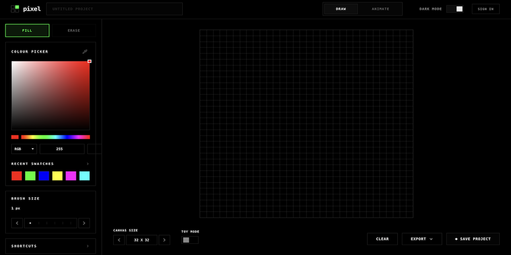

# Pixel Art

> A premium, dark-themed pixel art editor and animator — built for designers and developers who love clean interfaces.



---

## ✨ Features

### 🎨 Drawing Tools
- **Fill / Draw** — Paint pixels with your selected colour
- **Eraser** — Remove individual pixels or areas
- **Canvas Picker** — Sample any colour from the current canvas
- **EyeDropper API** — Pick any colour from anywhere on your screen (Chrome/Edge)
- **Brush Size** — Adjustable brush for painting multiple pixels at once

### 🎨 Colour Picker
- HSV saturation box with drag interaction
- Hue slider
- RGB and HEX input modes
- Recent colour swatches (up to 18 colours)
- Hover-reveal eyedropper icon for screen-wide colour picking

### 🖼️ Canvas
- Grid sizes from 8×8 up to 64×64
- **Toy Mode** — Renders the canvas with Lego-style 3D studs
- Dark and Light mode support
- Crisp sub-pixel rendering with `Math.round` coordinate snapping

### 💾 Project Management
- Save projects with a PNG thumbnail preview
- All projects are **persisted in `localStorage`** (survives page refresh)
- Click any saved project to **restore** it instantly
- Saving an open project **overwrites** instead of creating a duplicate
- Delete saved projects with a confirmation prompt

### 🎬 Animation Mode
- Multi-frame timeline editor
- Add frames and switch between them
- FPS control
- Onion skinning toggle
- Per-frame canvas state

### 📤 Export
- **Export PNG** — Full-resolution canvas download
- **Export SVG** — Scalable vector with per-pixel rects

### ⌨️ Keyboard Shortcuts
| Shortcut | Action |
|---|---|
| `Ctrl/Cmd + Z` | Undo |
| `Ctrl/Cmd + Shift + Z` | Redo |
| `Ctrl/Cmd + S` | Save project |
| `B` | Brush / Fill tool |
| `E` | Eraser tool |
| `[` | Decrease brush size |
| `]` | Increase brush size |

---

## 🧱 Tech Stack

| Layer | Technology |
|---|---|
| Framework | React 18 |
| Build Tool | Vite 6 |
| Styling | Tailwind CSS v4 |
| UI Primitives | shadcn/ui (Radix UI) |
| Icons | Lucide React |
| Language | TypeScript |

---

## 📁 Project Structure

```
src/
├── App.tsx                          # Root application state & layout
├── main.tsx                         # Entry point
├── components/
│   ├── canvas/
│   │   └── CanvasArea.tsx           # HTML5 Canvas renderer & interactions
│   ├── common/
│   │   ├── ColorPicker.tsx          # Reusable colour picker component
│   │   └── ShortcutsList.tsx        # Keyboard shortcuts reference UI
│   ├── layout/
│   │   └── TopNavigation.tsx        # Top nav bar (mode toggle, dark mode)
│   ├── panels/
│   │   ├── ToolsPanel.tsx           # Left panel (draw mode)
│   │   ├── SavedFilesPanel.tsx      # Right panel (saved projects)
│   │   ├── AnimationLeftPanel.tsx   # Left panel (animate mode)
│   │   ├── AnimationRightPanel.tsx  # Right panel (animate mode)
│   │   └── AnimationTimeline.tsx    # Bottom frame timeline
│   └── ui/
│       ├── CustomNumberInput.tsx    # Increment/decrement number field
│       └── DiscreteSlider.tsx       # Step-based slider component
├── hooks/
│   ├── usePixelHistory.ts           # Undo/redo pixel state stack
│   └── useGlobalShortcuts.ts        # Keyboard event bindings
├── utils/
│   ├── color.ts                     # HSV ↔ HEX ↔ RGB conversions
│   └── export.ts                    # PNG & SVG export helpers
└── styles/
    ├── index.css                    # Global styles & font imports
    ├── tailwind.css                 # Tailwind v4 entry
    └── theme.css                    # CSS custom properties / tokens
```

---

## 🚀 Getting Started

### Prerequisites
- **Node.js** v18 or higher
- **npm** v9 or higher

### Installation

```bash
# Clone the repository
git clone https://github.com/manish1803/pixel-art.git
cd pixel-art

# Install dependencies
npm install

# Start the development server
npm run dev
```

The app will be available at `http://localhost:5173`.

### Build for Production

```bash
npm run build
```

The production bundle will be output to the `dist/` folder.

---

## 🖥️ Browser Support

| Browser | Drawing | EyeDropper API |
|---|---|---|
| Chrome / Edge 95+ | ✅ | ✅ |
| Firefox | ✅ | ❌ (fallback to canvas picker) |
| Safari | ✅ | ❌ (fallback to canvas picker) |

> The EyeDropper API is a Chrome/Edge-only feature. A graceful fallback to the canvas colour picker is used in unsupported browsers.

---

## 🤝 Contributing

Contributions, issues and feature requests are welcome!

1. Fork the repository
2. Create your feature branch: `git checkout -b feat/your-feature`
3. Commit your changes: `git commit -m 'feat: add some feature'`
4. Push to the branch: `git push origin feat/your-feature`
5. Open a Pull Request

---

## 👤 Author

**Manish**
- GitHub: [@manish1803](https://github.com/Manish1803)

---

## 📝 License

This project is open source and available under the [MIT License](LICENSE).